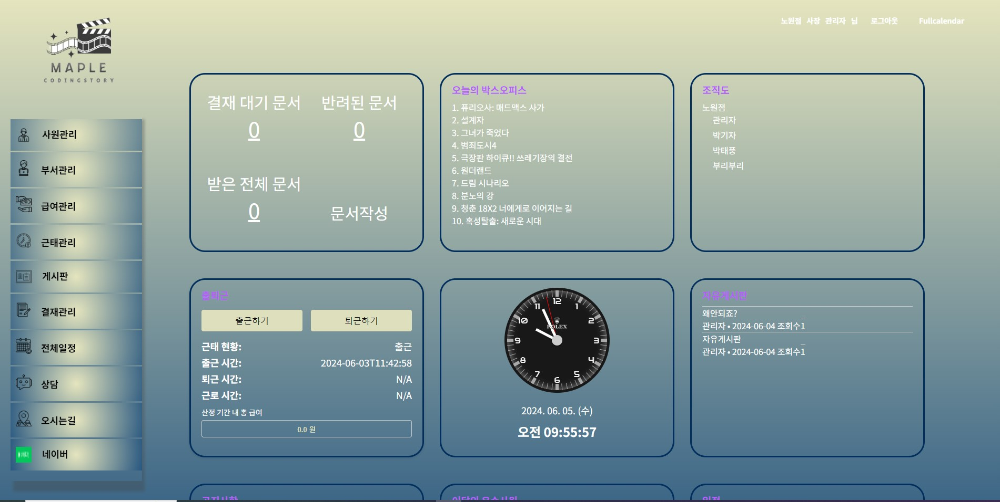
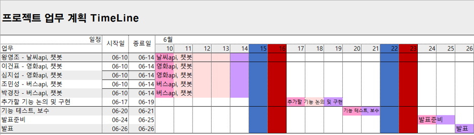
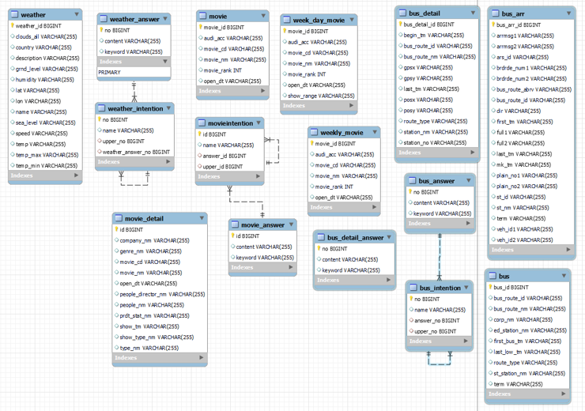
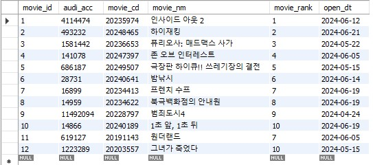
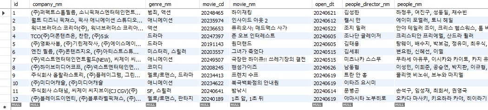

# 😀이건표 3차 프로젝트

### 🎥 시나리오형 챗봇 웹 개발

## 🎞 **프로젝트 명** : codingStory 🎞

#### **프로젝트 설명** : 영화사 시나리오형 챗봇 웹 개발

## 개요 ✨
2차 프로젝트에 Open API를 추가하여 유저에게 다양한 정보 제공
여름 휴가철을 맞이하여 사용자들에게 날씨, 영화, 버스 정보 등의 실시간 데이터를 제공하여 휴가 계획을 도움
본 사이트를 방문한 고객의 사용자 경험 향상

## 목차 📚
- [프로젝트 배경](#프로젝트-배경-)
- [프로젝트 일정](#프로젝트-일정-)
- [팀원구성 및 역할](#팀원구성-및-역할-)
- [기술 스택](#기술-스택-)
- [주요 기능](#주요-기능-)
- [기능시연 영상](#기능시연-영상-)
- [향후 개선 사항](#향후-개선-사항-)

## 프로젝트 배경 📜
*영화진흥위원회의 영화 API를 활용하여 최신 개봉작 및 인기 영화 정보를 제공  
*해외 영화 API를 활용하여 영화 포스터를 포함한 시각적 정보 제공

## 프로젝트 일정 🗓️

## 팀원구성 및 역할 👥

- **(팀장) 왕ㅇㅇ**: 날씨 API 날씨 챗봇
- **(팀원) 박ㅇㅇ**: 버스 챗봇
- **(팀원) 심ㅇㅇ**: 영화 API 영화 챗봇
- **(팀원) 이ㅇㅇ**: 영화 API 영화 챗봇
- **(팀원) 조ㅇㅇ**: 버스 API

## 기술 스택 🛠️

  
  
  
  
  
  
  
  
  
  

- **프로젝트명**: codingStory
- **프로그래밍 언어**: 
- **프레임워크**: Springboot 2.7.11
- **라이브러리**: Spring WEB(MVC), Thymeleaf, Spring Data JPA, Lombok, SpringSecurity5, websocket, validation, OAuth2, security, openAPI, KOMORAN, websocket
- **데이터베이스**: 
- **ORM**: Spring Data JPA (JAVA(SQL))
- **개발툴**: IntelliJ
- **템플릿 엔진**: Thymeleaf (HTML + Data)
- **빌드**: 
- **설정**: application.yml, application-oauth2.yml

## 주요 기능 🚀

### 영화API
| NO | 기능       | 설명                                                                  |
|----|----------|---------------------------------------------------------------------|
| 1  | 전체 영화검색  | TMDB사이트에서 전체영화검색을 ajax로 구현                                          |
| 2  | 일별 박스오피스 | 한국영화진흥위원회 API를 통해 일별박스오피스 + TMDB포스터 구현 |
| 3  | 주말 박스오피스 | 한국영화진흥위원회 API를 통해 주말박스오피스 + TMDB포스터 구현                              |
| 4  | 주중 박스오피스 | 한국영화진흥위원회 API를 통해 주중박스오피스 + TMDB포스터 구현                              |
| 5  | 영화 상세정보  | 한국영화진흥위원회 API를 통해 영화상세정보와 TMDB를 통해 줄거리 구현                           |
### 챗봇
| NO | 기능         | 설명                                   |
|----|------------|--------------------------------------|
| 1  | 각 박스오피스 순위 | 일별, 주말, 주중 박스오피스 순위를 버튼클릭으로 순위 답변 구현 |
| 2  | 영화 상세정보    | 영화제목 검색시 상세정보 답변 구현                  |

### DB

### DB에 정상적으로 들어가는 모습

박스오피스 순위 데이터     

영화 상세정보 데이터

## 기능시연 영상 🎬

### 전체영화검색

### 박스오피스 순위

### 챗봇

## 향후 개선 사항 🔧
이번 프로젝트는 API와 챗봇 작업을 팀원과 함께 번갈아 맡아 진행했습니다. 
덕분에 양쪽 모두에 대해 깊이 있게 배울 수 있었고, 결과물도 만족스러웠습니다. 
서로의 협업이 큰 도움이 되었고, 이 경험을 바탕으로 앞으로 더 나은 프로젝트를 진행하고 싶습니다.

**[⬆ 위로 가기](#이건표-3차-프로젝트)**
